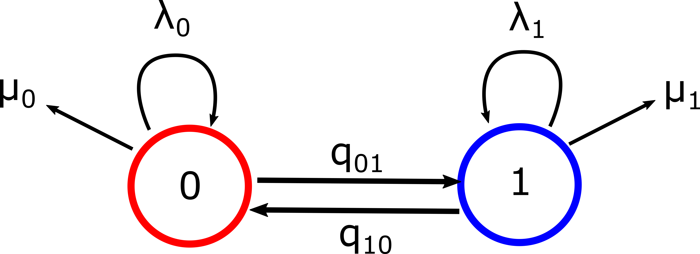
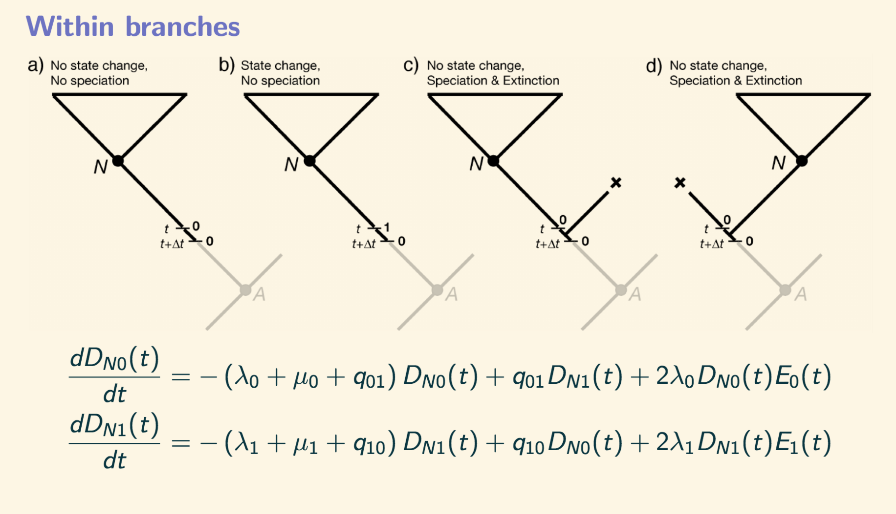
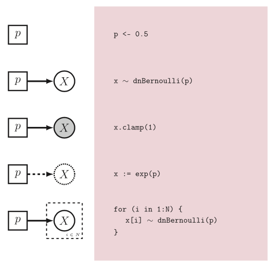

## Introducción

El objetivo de esta sección es familiarizar al lector con la diversificación dependiente de estados.  En la literatura estos modelos se llaman especiación y extinción dependiente de estados (state-dependent speciation and extinction models SSE). Este nombre se deriva de ligar el estado con su propia tasa de especiación y extinción.

### Recordatorio de las clases de los días pasados

+ Por favor vean los materiales de estadística bayesiana y MCMC en el primer día del curso [aquí](https://ixchelgzlzr.github.io/filo_bayes_UNAM/docs/intro_bayesian/Intro_bayesiana.html)

+ También la serie de classes del Dr. Paul Lewis [video](https://www.youtube.com/watch?v=4PWlnNsfz90).

+ La clase de las cadenas de Markov en tiempo continuo [CTMC](https://ixchelgzlzr.github.io/filo_bayes_UNAM/docs/discrete/ctmc.html)
+ Código de RevBayes para modelos discretos [mk2](https://ixchelgzlzr.github.io/filo_bayes_UNAM/docs/discrete/ctmc_revbayes.html)


### Modelos de diversificación dependiente de estado

#### El modelo BiSSE

BiSSE el modelo de especiación y extinción dependendiente de un caracter binario es un proceso estocástico que se forma de la composición de dos procesos de nacimiento y muerte. Los dos procesos se conectan a través de dos tasas de cambio conocidas como las tasas de transición. El supuesto más importante del modelo BiSSE es que cada estado tiene su propia tasa de especiación $$\lambda$$ y su propia tasa de extinción $$\mu$$ que representan el momento en el cuál un linaje se divide en dos o se extingue. Este es un supuesto muy importante porque la implicación es que la acumulación (o la falta de acumulación) de linajes es el resultado del valor del estado.

En la literatura, generalmente el modelo BiSSE se representa con un diagrama de círculos y flechas como se muestra aquí. 



*Figura 1. Representación del modelo BiSSE. Caracter es binario con parámetros $$(\lambda_0, \lambda_1)$$ que representan tasas de especiación y parámetros $$(\mu_0,\mu_1)$$ que representan tasas de extinción. Las tasas de transición $$(q_{01},q_{10})$$ indican como cambiar de un estado a otro en las ramas del árbol.*

La razón por la que frequentemente se representa con este diagrama BiSSE es porque es mucho más sencillo comunicar un modelo de esta manera que a través de sus ecuaciones. La representación matemática del BiSSE se hace a través de unas ecuaciones llamadas Kolmogorov-Forward. Son ecuaciones estocásticas que representan el cambio instantaneo en un tiempo infinitesimalmente pequeño. En otras palabras, estas equaciones definen el mínimo momento que precede la originación de un linaje o una extinción, o un cambio de estado (son como una derivada). 


*Figura 2. Ecuaciones diferenciales estocásticas que definen BiSSE.*

**¿Por qué es importante conocer estas ecuaciones?**

Tomemos un momento en profundizar sobre estas ecuaciones y su enterpretación. Por ejemplo, en la figura 2 la primera ecuación describe cómo obtener al clado $$N$$ que es descendiente de un linaje que empezó en estado 0. Hay tres posibilidades para que esto ocurra:

1. Antes del tiempo $$t$$ nada ocurrió el linaje tenía estado 0  no hubo especiación, ni extinción, ni cambio the estado. Así que esta primera parte de la ecuación  $$(\lambda_0+\mu_0+q_{01})D_{N_0}(t)$$ representa la probabiliad instantánea de que nada ocurrió.

 2. Hubo una transición de 0 a 1  con probabilidad instantánea $$q_{01}D_{N_1}(t)$$.
 
3. No hubo transiciones de estado pero existión una especiación con tasa $$\lambda_0$$, un linaje sobrevive y de ahí desciende nuestro clado $$N$$ con probabilidad instantánea $$D_{N_0}(t)$$  pero otro linaje se extingue con probabilidad instantánea $$E_0(t)$$. Es importante notar que solamente una coasa sucede a la vez, ya sea una diversificación o una transición pero no las dos simultáneamente. Esto es uno de los requerimientos principales de las cadenas de Markov porque nos enfocámos en un tiempo infinitesimalmente pequeño $$(t, t+\Delta t)$$  y la probabilidad de que dos cosas sucedan en este intervalo es cero. 


Estas ecuaciones más otras ecuaciónes de extinción (no mostradas aquí) se resuelven numéricamente dentro de todos los softwares para modelos SSE. Con más estados, las cosas se complican rápidamente (por ejemplo, ChromoSSE o ChromoHiSSE). Entre más estados, más difícil de ajustar estos modelos.

Otra observación importante es que en estas ecuaciónes $$\lambda$$ y $$\mu$$ siempre aparecen juntos. Esto es muy importante para la interpretación de los resultados, como veremos más adelante.

### BiSSE en RevBayes

Otra manera de pensar en los modelos SSE no es sólamente con los diagramas mostrados anteriormente, pero con un modelo gráfico formal, de la manera en que RevBayes lo entiende. En general, a mí me gusta mucho pensar en modelos de esta manera porque podemos hacer modelos mucho más complicados sin tener que escribir las ecuaciones difíciles. 

Es importante aclarar que un modelo gráfico en RevBayes no sólamente es una visualización, pero es una manera alternativa de hacer inferencia Bayesiana. Por eso es muy importante, empezar a familiarizarse con el código. 

**Lenguaje Rev**

Un breve recordatorio del lenguaje Rev como se introdujo en este taller (Höhna et al. 2013).


*Figura 3. De Höhna et al. 2013. Lenguaje Rev y su representación gráfica*

## Datos que utilizaremos en BiSSE

Para este tutorial vamos a ajustar un modelo para un caracter discreto. El caracter discreto es polinización y los estados son Insecto(0) o Viento (1).

103 taxones en una filogenia ultramétrica. Hemos muestrado 50% de este género de plantas

+ Lista de especies con su polinización - [Datos](files/poliniza_datos.csv)

+ Árbol filogenético- [Filogenia](files/poliniza_arbol.tre)


## Ejercicio 
 Corre el siguiente [código en RevBayes](files/bisse.Rev) en tu computadora. Pero mientras corre entendamos el código y dibujemos el modelo gráfico.
 
 1. ¿Cuántos parámetros hay?
 2. ¿Qué tiene en común con el ejercicio de CTMC que realizamos previamente?
 3. ¿Qué pasa con la estimación de la raíz?
 4. ¿Cuáles son los movimientos (propuestas) que utilizamos para el MCMC?
 5. ¿Cómo definimos los valores en la raíz de esta filogenia?
 

## Lo nuevo: las tasas de especiación y extinción

Vamos a definir nuestras tasas de especiación y extinción. Esta la parte en donde pensar con modelos gráficos ayuda. Creamos cuatro parámetros nuevos $$(\lambda_0, \lambda_1, \mu_0,\mu_1)$$ para definir el desino de los linajes de nuestra filogénia. 

Como estamos trabajando con estadística Bayesiana, lo que queremos definir son cuatro nuevas variables aleatorias que van a tener una distribución a priori. Busca en wikipedia las distribuciones de probabilidad, también llamadas[densidades](https://en.wikipedia.org/wiki/Probability_density_function) para investigar qué es lo que estamos utilizando en este código ([fíjate en estas densidades](https://en.wikipedia.org/wiki/List_of_probability_distributions#Continuous_distributions) pero especialmente en la [log-Normal distribution](https://en.wikipedia.org/wiki/Log-normal_distribution).

### Valores de la log-normal
Del artículo Nee et al. (1994) el número esperado de linajes en la corona de un clado con $$n$$ taxones bajo un proceso de nacimiento y muerte en el tiempo  $$t$$ es $$(\lambda-\mu)=\frac{ln(n)/2}{t}$$. 

```
####################
# Tasas de especiacion y extincion #
####################


### Definimos una a priori log normal donde la media es ln(#especies//2)/edad de la filogenia. Con una varianza H que es amplia
H = 0.587405
rate_mean <- ln( ln(103/2.0) / observed_phylogeny.rootAge() )
rate_sd <- 2*H

for (i in 1:NUM_STATES) {
    #lognormales de las especiaciones
log_speciation[i] ~ dnNormal(mean=rate_mean,sd=rate_sd)
speciation[i] := exp( log_speciation[i] )
moves.append(mvSlide(log_speciation[i],delta=0.20,tune=true,weight=3.0))

### lognormales de las extinciones
log_extinction[i] ~ dnNormal(mean=rate_mean,sd=rate_sd)
extinction[i] := exp( log_extinction[i] )
moves.append(mvSlide(log_extinction[i],delta=0.20,tune=true,weight=3))

net_diversification[i] := speciation[i] - extinction[i]
}
```


## Lo nuevo: La proporción del muestreo

Para los  modelos de diversificación es extremadamente importante definir la proporción que se ha muestrado de los linajes. Si esta proporción es menor al 50% lo más seguro es que nuestra inferencia resulte errónea.  Este es otro problema abierto para modelos de diversificación: cómo especificar la proporción muestrada. Por el momento, en RevBayes la única corrección que podemos hacer es através de la fracción de muestreo $$\rho$$.

```
### Fraccion del muestreo (menos de 0.5- ser mas critico con los resultados)

rho <- taxa/200
```

## Lo nuevo: Una distribución de probabilidad para la diversificación
 
 BiSSE también es un modelo de Markov en tiempo continuo pero es un caso especial. De hecho BiSSE son dos cadenas de nacimiento y muerte conectadas por transiciones. Por esta razón necesitamos una nueva distribución ``dnCDBDP()``- distribution of character dependent birth and death process.
 
```
bisse ~ dnCDBDP( rootAge = root_age,
speciationRates   = speciation,
extinctionRates   = extinction,
Q                 = rate_matrix,
pi                = root_frequencies,
rho               = rho,
delta             = 1.0,
condition         = "time" )

### Pinzando los datos- en este caso la filogenia y los datos
bisse.clamp(observed_phylogeny)
bisse.clampCharData( data )
```

### Artículos importantes


+ **RevBayes**: Höhna, S., Landis, M.J., Heath, T.A., Boussau, B., Lartillot, N., Moore, B.R., Huelsenbeck, J.P. and Ronquist, F., 2016. RevBayes: Bayesian phylogenetic inference using graphical models and an interactive model-specification language. Systematic biology, 65(4), pp.726-736.[link](https://academic.oup.com/sysbio/article/65/4/726/1753608)

+ **BiSSE**: Maddison WP, Midford PE, Otto SP. Estimating a binary character's effect on speciation and extinction. Systematic biology. 2007 Oct 1;56(5):701-10.[link](https://academic.oup.com/sysbio/article/56/5/701/1694265)

+ **BiSSE lack of heterogeneity**: Rabosky, D.L. and Goldberg, E.E., 2015. Model inadequacy and mistaken inferences of trait-dependent speciation. Systematic biology, 64(2), pp.340-355.[link](https://academic.oup.com/sysbio/article/64/2/340/1633695)

+ **MuSSE model selection in Bayesian Statistics**: Zenil‐Ferguson, R., Burleigh, J.G., Freyman, W.A., Igić, B., Mayrose, I. and Goldberg, E.E., 2019. Interaction among ploidy, breeding system and lineage diversification. New Phytologist. [pdf](/assets/docs/Zenil-Ferguson_et_al-2019-New_Phytologist.pdf) [supp1](/assets/docs/Zenil-Ferguson_et_al-2019-New_Phytologist.sup-2.pdf) [supp 2](assets/docs/Zenil-Ferguson_et_al-2019-New_Phytologist.sup-1.pdf) [repository](https://github.com/roszenil/solploidy)
