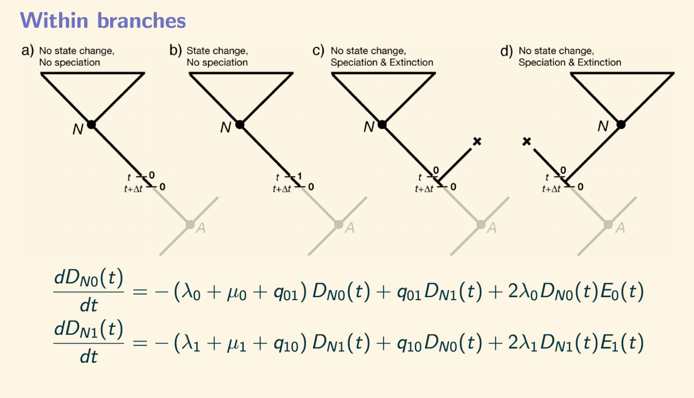

## Introduction

The goal of this tutorial is to familiarize students with state-dependent diversification. In the literature they are also known as the  state-dependent speciation and extinction models or SSE. First proposed by Maddison et al. 2007, these models are powerful tools to link traits and diversification. 

### Useful background

+ Dr. Paul Lewis'[video](https://www.youtube.com/watch?v=4PWlnNsfz90).
+ Introduction to CTMC
+ Revbayes for [Mk2](https://roszenil.github.io/mytutorials/docs/discrete/ctmc_revbayesEnglish))

## Binary state-dependent speciation and extinction (BiSSE)

BiSSE is an stochastic model that is comprised of two birth and death models connected by two transition rates. The most important assumption of BiSSE is that each state has its own rate of speciation $$\lambda$$ and extinction $$\mu$$. Speciation rates represent the instant when lineage splits into two and extinction represents the event when a lineage disappears. This assumption is super important because what we are stating is that the speed at which lineages accumulate or dissapear is strickly dependent of the value of the state.

In the literature the BiSSE model is often represented with the diagram below 


*Figure 1. Representation of BiSSE model. Parameters $$(\lambda_0, \lambda_1)$$ represent rates of speciation and $$(\mu_0,\mu_1)$$ represent rates of extintion. The transition rates $$(q_{01},q_{10})$$ assume changes in the character state that happened throughout branches.*

In the math world, BiSSE is defined through Kolmogorov forward equations. These equations allow us to represent instantaneous change of stochastic models, and they are the equivalent of differential equations but in the probability world. 

*Figure 2. Stochastic differential equations to define some BiSSE events. From Maddison et al. 2007.*

**Why do I bother mentioning these equations?**

Let's take a minute to deepen about these equations and their interpretation. For example, in Fig. 2 the first equation describes how to obtain the $$N$$ clade, that is a descendent of a clade that started in lineage with state 0. There are three possibilities to obtain this result:

1. Before time $$t$$ nothing happened. The lineage was in state 0, there wasn't speciation, extinction, nor transitions. Therefore,  $$(\lambda_0+\mu_0+q_{01})D_{N_0}(t)$$ represents the instantaneous probability of nothing happening. 

2. There was a transition from 0 a 1  with instantaneous probability $$q_{01}D_{N_1}(t)$$.
 
3.There were no transitions but an speciation occurred with rate $$\lambda_0$$. From this speciation one lineage survives and from there the $$N$$ clade survive with probaility $$D_{N_0}(t)$$. However, the secon lineage goes extinct with probability $$E_0(t)$$. Note that only one event occurs at a given time because these events occur at an infinitesimal small time interval $$(t, t+\Delta t)$$. In these types of models, the probability of two things occuring at the same time is zero. 


These equations, plus extinction equations (not shown here) are solved numerically inside all softwere. With more states, things get numerically complex quickly (i.e., ChromoSSE or ChromoHiSSE).

Another important observation is that in these equations $$\lambda$$ y $$\mu$$ always appear together. This is essential to understand as we will see it in the interpretation of the resuls of our inference. 

### BiSSE in RevBayes

In RevBayes we will represent differently the SSE models. We will use the probabilistic graphical approach. In general, I like to think about models this way because I can increase in complexity without having to jump into equations immediately. As a reminder, the graphical models in RevBayes are not only a visualization, but they are an alternative way to think about Bayesian inference.

**Rev language**

A small reminder of the rev language and what it means (Höhna et al. 2013).


*Figura 3. De Höhna et al. 2013. Lenguaje Rev y su representación gráfica*

## Data for BiSSE

For this tutorial we will create a discrete character model for a pollinization with two states: Insect pollination (I) is denoted by 0 and wind pollination (W) is 1.

103 taxa in a bifurcating and ultrametric tree. This is 50% of the whole genus. 

 + List with species and their pollinization [here](files/poliniza_datos.csv)
 
 + Phylogenetic tree- [here](files/poliniza_arbol.tre)
 


## Exercise
 Run the [RevBayes code](files/bisse.Rev) in your computer, but in the meantime let's think about the graphical model in paper. 
 
 1. How many parameters are there?
 2. What's in common with the Mk2 model that we ran earlier?
 3. What is happening with the estimation for the root values?
 4. Which proposals are we using for the MCMC?

 
## What's new? Speciation and extinction rates

Let's define our speciation and extinction rates. Graphical models help a lot in this goal. We are creating four new parameters $$(\lambda_0, \lambda_1, \mu_0,\mu_1)$$ to track the new or dissapearing lineages in the phylogeny. 

Remember that parameters in a Bayesian framework are random variables. Look in wikipedia the probability density functions [p.d.f](https://en.wikipedia.org/wiki/Probability_density_function) to investigate what we are doing in this code ([check out this](https://en.wikipedia.org/wiki/List_of_probability_distributions#Continuous_distributions) but specially the [log-Normal distribution](https://en.wikipedia.org/wiki/Log-normal_distribution).

### Values for the log-Normal
From Magallón and Sanderson (2001) proposed that the expected number of lineages from the crown of a clade with $$n$$ taxa under a birth and death process with age $$T$$ is estimated as  $$(\lambda-\mu)=\frac{ln(n)/2}{t}$$. 

```
####################
# Rates of speciation and extinction #
####################


### We define a prior for our speciaation and extinction rates with a broad variance
H = 1
rate_mean <- ln( ln(103/2.0) / observed_phylogeny.rootAge() )
rate_sd <- 2*H

for (i in 1:NUM_STATES) {
    #log-Normal for speciation
log_speciation[i] ~ dnNormal(mean=rate_mean,sd=rate_sd)
speciation[i] := exp( log_speciation[i] )
moves.append(mvSlide(log_speciation[i],delta=0.20,tune=true,weight=3.0))

### log-Normal for extinction
log_extinction[i] ~ dnNormal(mean=rate_mean,sd=rate_sd)
extinction[i] := exp( log_extinction[i] )
moves.append(mvSlide(log_extinction[i],delta=0.20,tune=true,weight=3))

net_diversification[i] := speciation[i] - extinction[i]
}
```


## Sampling proportion

For the SSE models it is important to define the proportion of the sampled lineages. What we know is that if we have less than 50% of the lineages we end up with biased results. An open problem in this field is what is the appropriate way to correct for sampling fraction, should we correct for clade? should we correct for state? this is unknown. 


```
### Sampling fraction (less than 0.5 produces biases in the results)

rho <- taxa/200
```

## The probability distribution for SSE models under a phylogeny
 
 BiSSE is also a CTMC but it is a special case, in fact it is two birth and death models connected by transition rates. In RevBayes we have two special functions for this type of model. In here we use the ``dnCDBDP()``- distribution of character dependent birth and death process.
 
```
bisse ~ dnCDBDP( rootAge = root_age,
speciationRates   = speciation,
extinctionRates   = extinction,
Q                 = rate_matrix,
pi                = root_frequencies,
rho               = rho,
delta             = 1.0,
condition         = "time" )

### Clamping the data to calculate the likelihood inside the dnCDBDP. We need to clamp our observed phylogeny.
bisse.clamp(observed_phylogeny)
bisse.clampCharData( data )
```

### Artículos importantes


+ **RevBayes**: Höhna, S., Landis, M.J., Heath, T.A., Boussau, B., Lartillot, N., Moore, B.R., Huelsenbeck, J.P. and Ronquist, F., 2016. RevBayes: Bayesian phylogenetic inference using graphical models and an interactive model-specification language. Systematic biology, 65(4), pp.726-736.[link](https://academic.oup.com/sysbio/article/65/4/726/1753608)

+ **BiSSE**: Maddison WP, Midford PE, Otto SP. Estimating a binary character's effect on speciation and extinction. Systematic biology. 2007 Oct 1;56(5):701-10.[link](https://academic.oup.com/sysbio/article/56/5/701/1694265)

+ **BiSSE issues**: Rabosky, D.L. and Goldberg, E.E., 2015. Model inadequacy and mistaken inferences of trait-dependent speciation. Systematic biology, 64(2), pp.340-355.[link](https://academic.oup.com/sysbio/article/64/2/340/1633695)

+ **MuSSE model selection in Bayesian Statistics**: Zenil‐Ferguson, R., Burleigh, J.G., Freyman, W.A., Igić, B., Mayrose, I. and Goldberg, E.E., 2019. Interaction among ploidy, breeding system and lineage diversification. New Phytologist. [pdf](/assets/docs/Zenil-Ferguson_et_al-2019-New_Phytologist.pdf) [supp1](/assets/docs/Zenil-Ferguson_et_al-2019-New_Phytologist.sup-2.pdf) [supp 2](assets/docs/Zenil-Ferguson_et_al-2019-New_Phytologist.sup-1.pdf) [repository](https://github.com/roszenil/solploidy)

+ **Average diversification rate**: Magallón, S. and Sanderson, M.J., 2001. Absolute diversification rates in angiosperm clades. Evolution, 55(9), pp.1762-1780.[link](https://onlinelibrary.wiley.com/doi/abs/10.1111/j.0014-3820.2001.tb00826.x)

+ **Sampling fraction biases**: Mynard, P., Algar, A.C., Lancaster, L.T., Bocedi, G., Fahri, F., Gubry-Rangin, C., Lupiyaningdyah, P., Nangoy, M., Osborne, O.G., Papadopulos, A.S. and Sudiana, I.M., 2023. Impact of phylogenetic tree completeness and mis-specification of sampling fractions on trait dependent diversification models. Systematic Biology, 72(1), pp.106-119.[link](https://academic.oup.com/sysbio/article/72/1/106/6988090)
 
