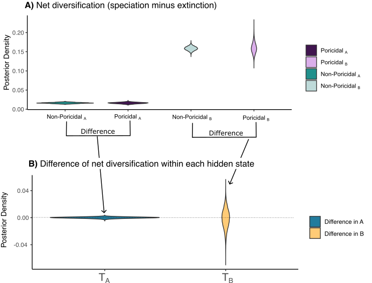

## HiSSE: El modelo más completo

Uno de los descubrimientos más importantes en el campo de los modelos de diversificación dependientes de estado (SSE) fue hecho por Rabosky y Goldberg (2015). Estos autores encontraron, que BiSSE generaba un elevado error tipo I. En estadística este error se refiere a rechazar la hipótesis nula cuando en general la hipótesis es verdadera. Este descubrimiento fue un parteagüas en el campo, ilustrando que ligar la diversificación a una variable discreta no es sencillo. 

### ¿Cuál es la hipótesis central de los SSE?

El modelo BiSSE propone rechazar la hipótesis de que la diversificación neta es igual para el estado 0 o para el estado 1. Esta hipótesis esta basada en lo que llamamos "tempo" o el paso de la diversificación. Si para los dos estados rechazamos que este tempo es igual, esto significa que el estado 0 o el estado 1 hacen la diferencia en la diversificación del clado.

En términos matemáticos esta hipótesis nula se define como

$$H_0: r_0=(\lambda_0-\mu_0) = r_1=(\lambda_1-\mu_1)$$

donde $$r_0=\lambda_0-\mu_0$$ es la diversificación neta en el estado 0 y $$r_1=\lambda_1-\mu_1$$ es la diversificación neta en el estado 1. Si rechazamos $$H_0$$ significaque estas dos diversificaciones son diferentes y podemos concluir que la variable discreta cambia el paso de la diversificación. Pero si rechazamos más de lo esperado, entonces concluimos incorrectamente que nuestro caracter importa ¿cierto?, de ahí que la contribución de Rabosky y Goldberg es crucial en este campo. Entonces, cómo podemos arreglar este problema de la hipótesis nula?- la respuesta esta en utilizar estados escondidos como lo veremos a continuación. 

## La nueva hipótesis

Con un poco de experiencia en la construcción de árboles filogenéticos nosotros entendemos hay mucha variación en la manera en que se acumulan los linajes, unos más rápido y unos más lento. Esta idea se refiere al tempo, y este tempo ¿se refiere sólamente a una variable? o ¿hay otras razones por las que el tempo de los linajes cambian que no es sólamente el caracter de interés? La respuesta es obvia aquí, hay muchas otras razones por las que el tempo de la diversificación cambia, no sólo el caracter de interés entonces tenemos que diseñar un modelo que genere una nueva hipótesis nula que separe el efecto de mi caracter de interés de otras situaciones que afectaron el tiempo.

## El modelo HiSSE y la definición de estados escondidos

Para lograr encontrar el efecto de la diversificación en el mar de otras cosas que pudieran suceder definimos los estados escondidos, son estados que ocurren al mismo tiempo que los estados del caracter de interés, pero que incorporan incertidumbre y variabilidad en el tempo de la diversificación. En general utilizamos dos estados escondidos pero se pueden utilizar más de dos, si uno quiere modelar más variabilidad. No hay reglas estrictas pero en la práctica se agregan el mismo número de estados escondidos que define el mismo número de tasas de diversificación que el modelo original (esto será más claro un poco más adelante). Este modelo fue propuesto por Beaulieu y O'Meara (2016) y se ha convertido en la herramienta más importante de este campo.  

Definiendo el modelo HiSSE requiere entonces las siguientes consideraciones

1. Si tenemos dos estados 0 y 1, estos se convierten en los estados ahora en cuatro estados  0A, 0B, 1A, 1B
2. Para cada uno de los estados escondidos definimos una nueva tasa de especiación $$\lambda_{0A}$$, $$\lambda_{0B}$$, $$\lambda_{1A}$$ y $$\lambda_{1B}$$
3. Para cada uno de los estados escondidos definimos una nueva tasa de extinción $$\mu_{0A}$$, $$\mu_{0B}$$, $$\mu_{1A}$$ y $$\mu_{1B}$$
4. Definimos tasas de transición entre 0 y 1. Esto lo podemos hacer de varias maneras, pero por el momento asumamos 4 tasas $$q_{01}^A, q_{01}^B, q_{10}^A, q_{10}^B$$
5. Definimos tasas de transición entre los estados escondidos. Lo podemos hacer de varias maneras pero por el momento hagamos $$q_{AB}=\alpha$$ y $$q_{BA}=\beta$$

*Figura 1. Modelo HiSSE con un caracter principal con dos estados y asociando dos estados escondidos*

## La nueva hipótesis nula y la ventaja de un HiSSE bayesiano

Para probar que el tempo de la diversificación se debe al caracter 0 y 1 y no a alguna causa más Beaulieu y O'Meara (2016) propusieron un modelo más llamado  CID (character independent model)- modelo de caracter independiente. El CID es un submodelo del HiSSE (Fig. 1) que asume las siguientes condiciones

1. Las especiaciones y extinciones entre 0 y 1 para A y B son iguales $$\lambda_{0A}=\lambda_{1A}$$ $$\lambda_{0B}=\lambda_{1B}$$, $$\mu_{0A}=\mu_{1A}$$ y $$\mu_{0B}=\mu_{1B}$$
2. Las especiaciones y extinciones entre A y B para 0 y 1 son diferentes $$\lambda_{0A}\neq\lambda_{0B }$$ $$\lambda_{1A} \neq \lambda_{1B}$$, $$\mu_{0A}=\neq \mu_{0B}$$ y $$\mu_{1A} \neq \mu_{1B}$$

En inferencia con verosimilitud, ajustaríamos este modelo y compararíamos este modelo contra BiSSE utilizando el criterio de información AIC que se basa en la función de verosimilitud. Si el CID tiene un mejor AIC entonces concluímos que la diversificación se debe a algo más pero no a nuestro caracter de interés.

Afortunadamente, en estadística Bayesiana, no tenemos que hacer una selección de modelos, ni siquiera ajustar BiSSE, ni el CID. Es suficiente, ajustar el HiSSE como se muestra en nuestra figura 1 y después interpretar las distribuciones posteriores, y transformarlas para probar nuestras hipótesis de interés. Incluso, con estadística Bayesiana, podemos encontrar historias de diversificación mucho más interesantes que con el criterio de información AIC. 

*Figura 2. Flujo de trabajo de los modelos de diversificación. En la izquierda el flujo de trabajo con la función de verosimilitud y el criterio de información AIC requiere que de entrada se ajusten múltiples modelos. La razón por la cual esto sucede es porque la bajo la verosimilitud solamente obtenemos un estimador puntual para los parámetros llamado el máximo verosímil. En la derecha el flujo de trabajo con estadística bayesiana y el MCMC. Sólo necesitamos ajustar el modelo HiSSE y obtener las distribuciones posteriores de los parámetros. Después transformaremos las muestras de las posteriores para probar nuestras hipótesis de diversificación (Figura creada por Dr. Jenna McCullough).*

## Probando las hipótesis de diversificación con estadística bayesiana

Cuando ajustamos el modelo HiSSE, ajustar otros modelos de diversificación no es necesario porque podemos transformar la distribuición posterior para probar nuestras hipótesis del tempo de la diversificación. Para probar esto  recordemos las hipótesis del modelo CID

$$H_0:$$
$$\lambda_{0A}=  \lambda_{1A}$$
$$\lambda_{0B}=\lambda_{1B}$$
$$\mu_{0A}=\mu_{1A}$$
$$\mu_{0B}=\mu_{1B}$$

$$\textrm{además}$$
$$\lambda_{0A}\neq\lambda_{0B }$$ 
$$\lambda_{1A} \neq \lambda_{1B}$$
$$\mu_{0A}=\neq \mu_{0B}$$ 
$$\mu_{1A} \neq \mu_{1B}$$

Para probar esta hipótesis vamos a seguir los siguientes pasos:

1. Crear dos estadísticas resumen con las distribuciones posteriores haciendo la diferencia entre las diversificaciones netas de los estados A y B respectivamente
 $$T_A= (\lambda_{0A}-\mu_{0A})-(\lambda_{1A}-\mu_{1A})$$ y $$T_B= (\lambda_{0B}-\mu_{0B})-(\lambda_{1B}-\mu_{1B})$$.
 
 2. Graficamos estas estadísticas, el valor cero cruza estas distribuciones? Si el valor cero cruza quiere decir que 0 y 1 no son diferentes
 
 3. Formalmente calculamos el cuantil 0 de las distribuciones posteriores de $T_A$ y $T_B$. Es decir calculamos $$P(T_A>0)$$, si esta probabilidad es mayor a 0.05 esto significa que 0 y 1 no son diferentes en el estado A, y lo mismo para B.
 
 

*Figura 3. Observa el resultado de este HiSSe para la el caracter de las anteras de las flores (no-poricidal y poricidal) en (A) tenemos las distribuciones posteriores de las diversificaciones netas para los cuatro estados. En  (B) tenemos las estadísticas $$T_A$$ y $$T_B$$, donde claramente el cero cruza las distribuciones, mostrando que los estados 0 y 1 no son distintos en la diversificación. Esto equivale a ajustar el modelo CID. Resultado de Russell, Zenil-Ferguson, et al. 2024.*

## Interpretando rápido de los resultados

Lo mejor de tener un enfoque bayesiano es que sólo necesitamos hacer HiSSE para concluir que modelo SSE es el correcto. 

*Figura 4. Observa los posibles resultados de los parámetros de diversificación neta del HiSSE en RevBayes. El traslape de las probabilidades posteriores de los parámetros de diversificación neta graficadas como violines indican cuál modelo de diversificación siguen tus datos.(Figura creada por Dr. Jenna McCullough)*

### Artículos importantes

+ **HiSSE and CID**: Beaulieu, J.M. and O’Meara, B.C., 2016. Detecting hidden diversification shifts in models of trait-dependent speciation and extinction. Systematic biology, 65(4), pp.583-601.[link](https://academic.oup.com/sysbio/article/65/4/583/1753616)

+ **GeoHiSSE**: Caetano, D.S., O'Meara, B.C. and Beaulieu, J.M., 2018. Hidden state models improve state‐dependent diversification approaches, including biogeographical models. Evolution, 72(11), pp.2308-2324.[link](https://onlinelibrary.wiley.com/doi/abs/10.1111/evo.13602)

+ **MuHiSSE and extinction**: Zenil-Ferguson, R., McEntee, J.P., Burleigh, J.G. and Duckworth, R.A., 2023. Linking ecological specialization to its macroevolutionary consequences: An example with passerine nest type. Systematic Biology, 72(2), pp.294-306.

+ **HiSSE and hypothesis testing in Bayesian**: Russell AL, Zenil-Ferguson R, Buchmann S, Jolles DD, Kriebel R, Vallejo-Marin ML. Widespread evolution of poricidal flowers: A striking example of morphological convergence across flowering plants. bioRxiv. 2024:2024-02.
