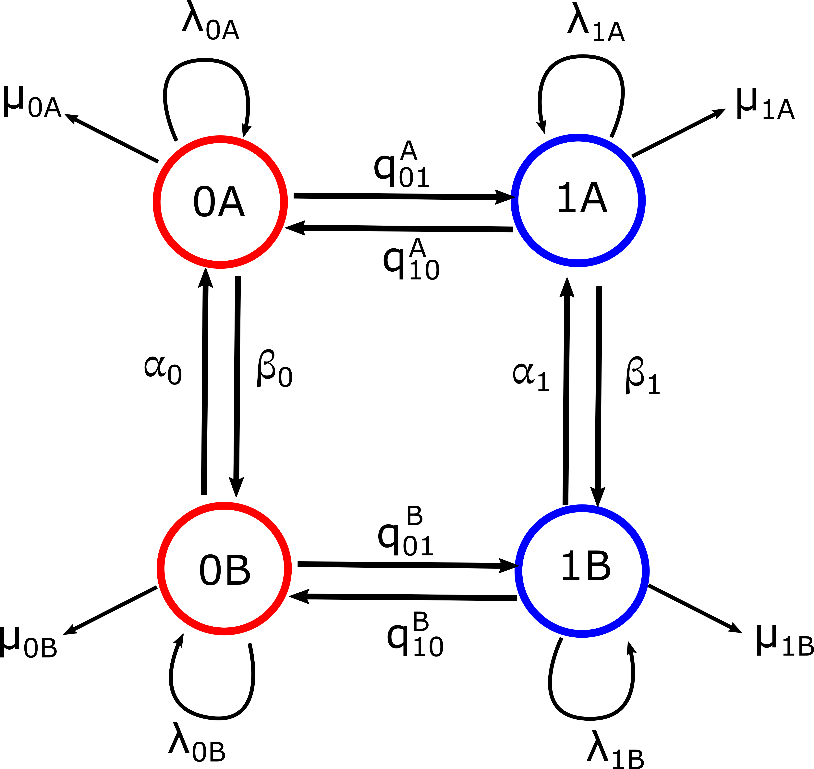
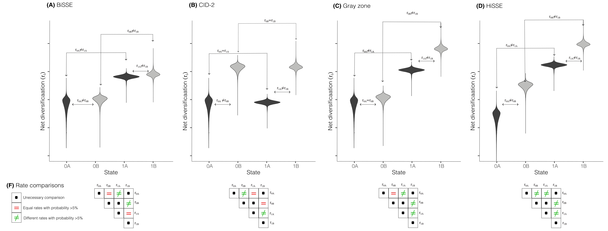
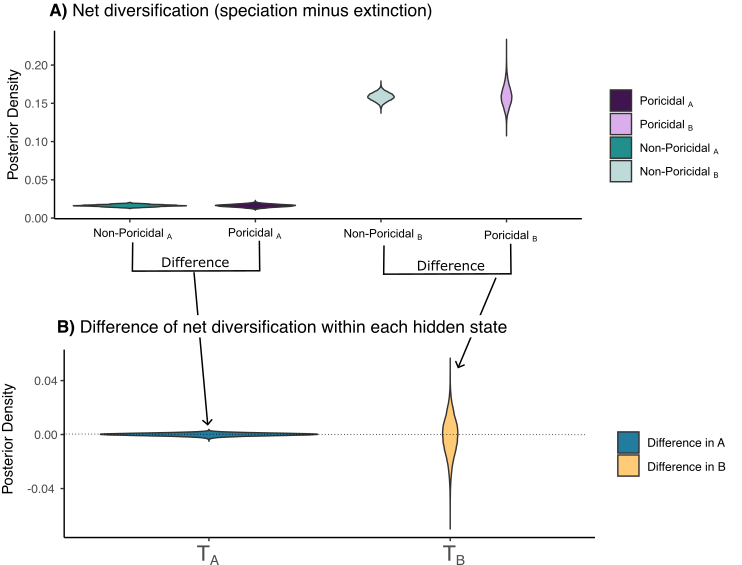

## HiSSE: A better model for state-dependent diversification

One of the most important discoveries in the field of state-dependent diversification models was brought to us by a paper by Dan Rabosky and Emma goldberg (2015). The authors discovered that BiSSE had a high type I error which means rejecting the null hypothesis when it is false. 

### What is the null hypothesis of BiSSE?

BiSSE's null hypothesis states that the net diversification of state 0 and 1 is equal. This hypothesis is based on the tempo of diversification. If we reject this hypothesis we conclude that states 0 and 1 make a difference in the tempo of diversification, effectively correlating the trait values to the speciation and extinction processes.

In mathematical terms the null hypothesis of BiSSE is 

$$H_0: r_0=(\lambda_0-\mu_0) = r_1=(\lambda_1-\mu_1)$$

where $$r_0=\lambda_0-\mu_0$$ is the net diversification of state 0, and $$r_1=\lambda_1-\mu_1$$ is the net diversification of state 1. If we reject $$H_0$$  this is interpreted as  $$r_0\neq r_1$ and we conclude that the discrete trait modifies the tempo of diversification. But if we are rejecting in circumstances where we shouldn't (a.k.a high type I error) then we conclude our trait matters for diversification when it doesn't. This is a key error! Hence, the importance of the contribution of Rabosky and Goldberg.

 How can we fix this key problem? The answer is using a mathematical trick called **the hidden states** as we will study next. 
 
## BiSSE is so simple that it makes mistakes

Using our experience building phylogenetic trees, we can clearly see how trees accumulate lineages at different paces across the phylogeny. There are key examples of this in big phylogenies (i.e., *Amborella* is the single species sister to all of the flowering plants). Do we think that a single trait can modify the tempo of diversification?  are there other factors that could be changing diversification? Are those factors correlated with my trait? and most importantly, how do we separate the effect of the trait from other noise in the diversification process?

It is clear that there are other factors and traits that can be modifying diversification. Therefore, we have to come up with a new null hypothesis and a new way to separate the trait from other factors changing the tempo of diversification. 

## The new model is HiSSE and the use of hidden states

We define now a set of hidden states that occur correlated to the states of the main trait but represent other factors or "noise" that changes the tempo of diversification. The mathematical tool we are using here are the hidden Markov models, which are widely used in other applications to represent part of the process that we don't directly measure. We will start with two hidden states for two main states but in theory you can add as many as you wish to. In practice, we add the same number of hidden states as the main states (the why will be clearer in a little bit). This model was proposed by Beaulieu y O'Meara (2016) and it has become the most useful tool in the state-dependent diversification field. 

We define the HiSSE model as follows:

1. We have two main states 0 and 1 and we "expand" them to 0A, 0B, 1A, 1B
2. For each of these new four states we define a speciation rate $$\lambda_{0A}$$, $$\lambda_{0B}$$, $$\lambda_{1A}$$ and $$\lambda_{1B}$$
3. For each of the new four states we define an extinction rate $$\mu_{0A}$$, $$\mu_{0B}$$, $$\mu_{1A}$$ and $$\mu_{1B}$$
4. We define the transition rates between 0 and 1. There are many ways to do this but let's assume all different $$q_{01}^A, q_{01}^B, q_{10}^A, q_{10}^B$$
5. We define the transition rates between hidden states as $$q_{AB}=\alpha$$ y $$q_{BA}=\beta$$ (we could also assume all different, but this was the original assumption).

*Figure 1. HiSSE model with one main trait with two states and two hidden states*

## The new hypothesis and the advantage of doing it the Bayesian way.

In order to test whether 0 and  1 are truly associated to diversification and not something else, Beaulieu and O'Meara (2016) proposed one more model called the CID for character-independent model. The CID-2 is a special case of the HiSSE model that assumes:

1. Speciation and extinction rates between 0 and 1 for A and B are equal. That is, $$\lambda_{0A}=\lambda_{1A}$$ $$\lambda_{0B}=\lambda_{1B}$$, $$\mu_{0A}=\mu_{1A}$$ and $$\mu_{0B}=\mu_{1B}$$
2. Speciation and extinction rates between A y B for 0 and 1  are different. That is, $$\lambda_{0A}\neq\lambda_{0B }$$ $$\lambda_{1A} \neq \lambda_{1B}$$, $$\mu_{0A}=\neq \mu_{0B}$$ y $$\mu_{1A} \neq \mu_{1B}$$

Note that CID-2 has the number 2 associated to refer to the number of free net diversification rates. 

Using the likelihood framework as in hisse package in the R platform we would have to fit BiSSE and compare it to the CID becuase those two models have the same number of free diversification rates. We compare models using an information criterion called the AIC that uses the likelihood function. If CID has a smaller AIC then we conclude that diversification is due to something else and not our trait. 

However, in Bayesian statistics we don't have to do a model selection procedure to test this hypothesis. It is sufficient to adjust a full HiSSE and figure out if we get a BiSSE, CID-2 or HiSSE. If we get a full HiSSE then we have to adjust a slightly more complicated HiSSE after to make sure that diversification is not only pure hidden states but that is for another tutorial. In the Bayesian framework because we get full posterior distributions we can directly test which rates are equal or different, and we could find more interesting diversification stories (like the gray zone shown here) that describe maybe a partial diversification story. 
 

*Figure 3. Using a HiSSE model in a Bayesian framework we can find which net diversifications are equal and different. Depending on which posterior distributions of net diversification rates are overlapping we can end up in any of these cases. In (F) you can see what are the comparisons that should be equal, different, or not done between every two posterior distributions.*

## Testing diversification hypothesis in a Bayesian framework

The new null hypothesis that is represented by the CID-2 model is 

$$H_0:$$
$$\lambda_{0A}=  \lambda_{1A}$$
$$\lambda_{0B}=\lambda_{1B}$$
$$\mu_{0A}=\mu_{1A}$$
$$\mu_{0B}=\mu_{1B}$$

$$\textrm{also}$$
$$\lambda_{0A}\neq\lambda_{0B }$$ 
$$\lambda_{1A} \neq \lambda_{1B}$$
$$\mu_{0A}=\neq \mu_{0B}$$ 
$$\mu_{1A} \neq \mu_{1B}$$

To test this hypothesis we will follow the next steps

1. We create two summary statistics that represent the difference between net diversifications for hidden state A and hidden state B respectively:
 $$T_A= (\lambda_{0A}-\mu_{0A})-(\lambda_{1A}-\mu_{1A})$$ and
  $$T_B= (\lambda_{0B}-\mu_{0B})-(\lambda_{1B}-\mu_{1B})$$.
 
 2. We plot these two test statistics and check if zero crosses these posterior distributions
 
 3. Formally we calculate the quantile that 0 represents for $$T_A$$ y $$T_B$$. This means that we are calculating if  $$P(T_A>0 \textrm{ or }T_A<0)$$, if this probability is greater than 0.05 this means that 0 and 1 are not different for state A or state B. 
 

*Figure 3. Look the result of this HiSSE for one of my examples of poricidal anthers. In (A) we have that the posterior distributions of the net diversifications for the four states. In (B) we have the summary  statistics $$T_A$$ y $$T_B$$, where zero clearly crosses the distributions, showing that 0 and 1 are not different in diversification. This is equivalent to adjust the CID-2 model. Results from: Russell, Zenil-Ferguson, et al. 2024.*

## Quick interpretation of results

The biggest advangate of having a Bayesian approach is that we only need to fit HiSSE to conclude which initial model is more sensitife to our data. 

### Important reads!

+ **BiSSE and type I error**: Rabosky, D.L. and Goldberg, E.E., 2015. Model inadequacy and mistaken inferences of trait-dependent speciation. Systematic biology, 64(2), pp.340-355.[link](https://academic.oup.com/sysbio/article-abstract/64/2/340/1633695)

+ **HiSSE and CID**: Beaulieu, J.M. and O’Meara, B.C., 2016. Detecting hidden diversification shifts in models of trait-dependent speciation and extinction. Systematic biology, 65(4), pp.583-601.[link](https://academic.oup.com/sysbio/article/65/4/583/1753616)

+ **GeoHiSSE**: Caetano, D.S., O'Meara, B.C. and Beaulieu, J.M., 2018. Hidden state models improve state‐dependent diversification approaches, including biogeographical models. Evolution, 72(11), pp.2308-2324.[link](https://onlinelibrary.wiley.com/doi/abs/10.1111/evo.13602)

+ **MuHiSSE and extinction**: Zenil-Ferguson, R., McEntee, J.P., Burleigh, J.G. and Duckworth, R.A., 2023. Linking ecological specialization to its macroevolutionary consequences: An example with passerine nest type. Systematic Biology, 72(2), pp.294-306.

+ **HiSSE and hypothesis testing in Bayesian**: Russell AL, Zenil-Ferguson R, Buchmann S, Jolles DD, Kriebel R, Vallejo-Marin ML. Widespread evolution of poricidal flowers: A striking example of morphological convergence across flowering plants. bioRxiv. 2024:2024-02.
