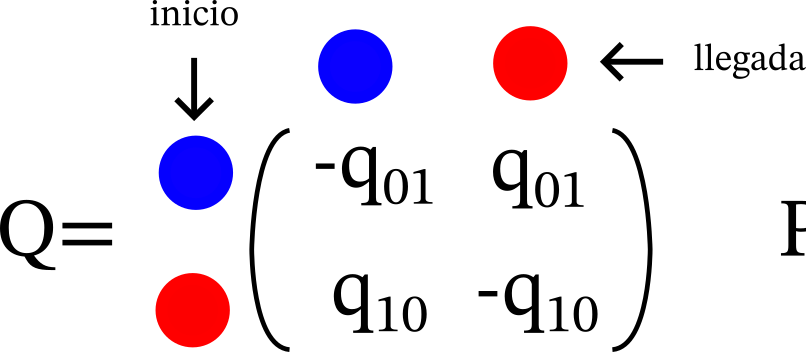
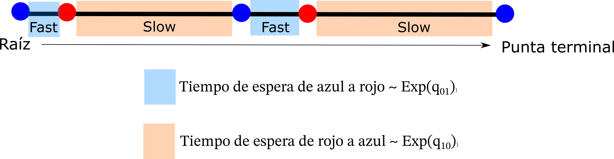
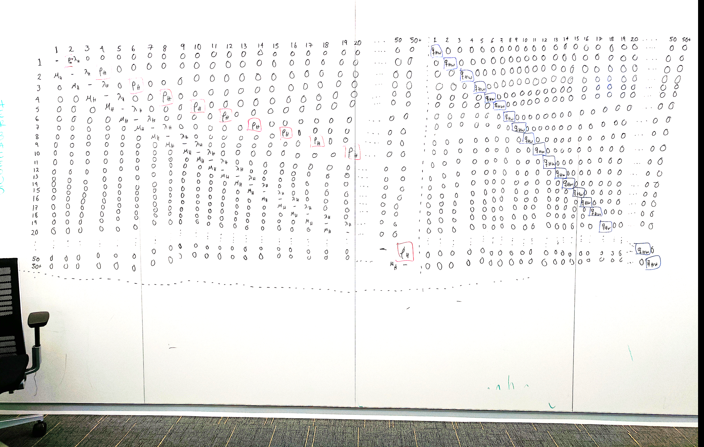
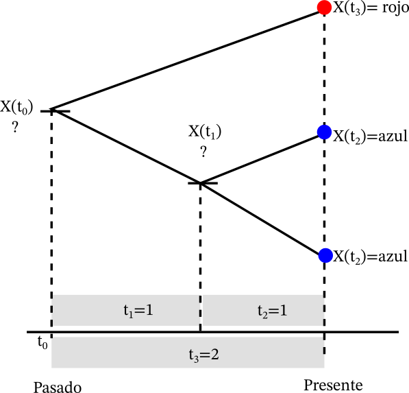
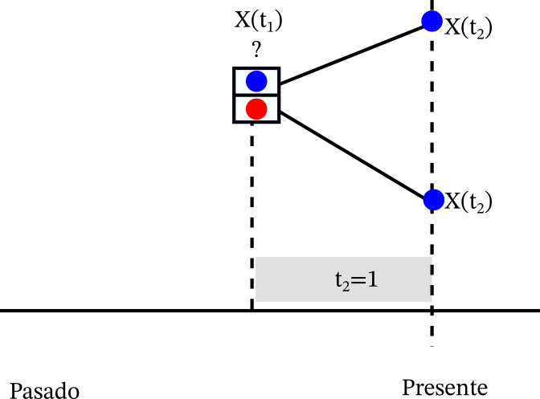
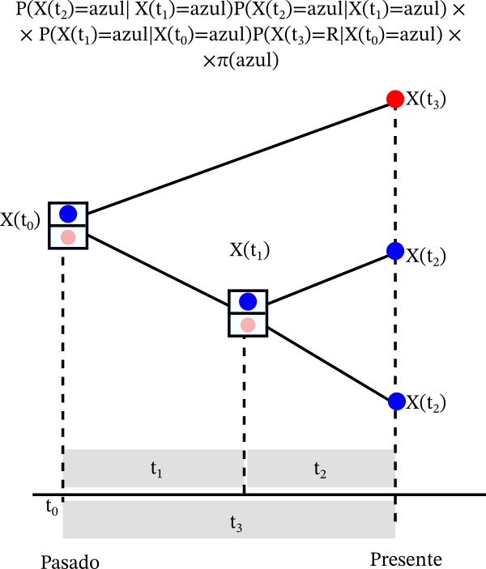

Creado por Rosana Zenil-Ferguson (Diciembre 2024)

Las cadenas de Markov en tiempo continuo (CTMC- Continuous-time Markov chains) son procesos estocásticos que nos permiten seguir la evolución de las tasas evolutivas para caracteres discretos y continuos en macroevolución. En este ejemplo, estamos interesados en la evolución entre dos estados azul y rojo, pero si piensan en biogeografía, puedes pensar en las transiciones entre dos regiones A y B. 

Las cadenas de Markov usualmente se denotan utilizando la siguiente notación matemática $$\{X(t), t\geq 0 \}$$. En esta notación el proceso estocástico $$X(t)$$ denota el valor de estado o caracter en el tiempo $$t$$ y el tiempo es medido en millones de años. El tiempo es continue y se mide en las longitudes de ramas. El proceso estocástico $$X(t)$$ toma valores en los números naturales $$0,1,2,...$$.  Las CTMC tienen muchas propiedades interesantes, pero la más importante para nosotros en biología es la propiedad Markoviana de la pérdida de memoria, esta propiedad es fácil de entender en palabras "El futuro, sólo depende del presente pero no del pasado". En el uso de las filogenias esto nos ayuda para definir la función de verosimilitud porque para saber que pasa con un clado, lo único que necesitamos conocer es el ancestro común del clado pero ninguno de los otros ancestros. 

Matemáticamente las CTMC se pueden definir utilizando ecuaciones diferenciales estocásticas, pero en el caso discreto sólo necesitamos una herramienta llamada la Q matriz  que es la derivada de la matriz de probabilidad, pero se define de manera sencilla como lo describo a continuación. 

## ¿Qué es la matriz Q?

En matemáticas, la matriz Q es la derivada de la matriz de probabilidad ($$P'(t)=P(t)Q$$). Los elementos de la matriz $$Q$$  son las tasas de transición que vamos a definir en la siguiente sección, pero en la diagonal vamos a  escribir la suma de los elementos fuera de la diagonal pero en negativo. Esto es fácil de entender cuando pensamos que una matriz de probabilidades debe de sumar uno, así que la derivada debe sumar cero.

### Ejemplo con colores

Estamos interesados en entender cómo una variable es discreta con dos estados (azul y rojo) han evolucionado y cambiado en el tiempo.




La evolución de azul (estado 0) a rojo (estado 1) sucede con parámetro $$q_{01}$$ y de rojo a azul sucede con parametro $$q_{10}$$. Estos parámetros se interpretan como tasas instantáneas de transición. Esto quiere decir la derivada del cambio en el tiempo. 



 Para evolucionar de azul a rojo en un linaje vamos a esperar en promedio $$1/q_{01}$$ unidades de tiempo. Si $$q_{01}$$ es un valor grande esto significa que vamos a esperar muy poco tiempo para ver una transición, mientras que si este valor es pequeño muy rara vez observamos una transición.  Las unidades de tiempo aquí son muy útiles para estimar estos parámetros, millones de años en una rama, lo que quiere decir que si tenemos una idea del número esperado de cambios podemos elicitar distribuciones a priori para nuestro model. 

** ¿Cuál es la probabilidad de evolucionar de azul a rojo?**

Las tasas en la matriz Q son derivadas de la probabilidad. En general, la matriz de probabilidad $$P(t)$$ se relaciona con la matriz $$Q$$ con la siguiente fórmula:

$$P(t)=e^{Qt}$$ 

La solución general entonces para la matriz de probabilidad es la siguiente

$$P(t)=\frac{1}{q_{01}+q_{10}} 
  \left( {\begin{array}{cc}
   q_{10}+q_{01}e^{-(q_{01}+q_{10})t} & q_{01}-q_{01}e^{-(q_{01}+q_{10})t} \\
      q_{10}-q_{10}e^{-(q_{01}+q_{10})t} & q_{01}+q_{10}e^{-(q_{01}+q_{10})t} \\
  \end{array} } \right)$$

```
prob.mat<-function(q_01,q_10,t){
exp.val<-exp(-(q_01+q_10)*t)
probabilities<-1/(q_01+q_10)*matrix(c(q_10+q_01*exp.val, q_10-q_10*exp.val, q_01-q_01*exp.val, q_01+q_10*exp.val),nrow=2)
return(probabilities)
}

(P.mat<- prob.mat(q_01=0.2, q_10=0.3, t=1))
```

Se ve un poco fea la solución pero se lee como sigue: En el tiempo $$t$$ la probabilidad de que un linaje evolucione de azul a rojo es

 $$P(X(t)=rojo \lvert X(0)=azul)=\frac{1}{q_{01}+q_{10}}(q_{10}-q_{01} e^{-(q_{01}+q_{01})t})$$.

Las matrices Q pueden ser tan grandes como las imaginamos! Por ejemplo, para un modelo de evolución de los cromosomas la matriz Q es tan grande como la imaginamos. 



En general calcular la matriz de probabilidades $$P(t)$$ no es tan sencillo como en el caso de una matrix $$Q$$ de 2x2. En general se resuelven numéricamente como se muestra en el siguiente código. 

```
#install.package("expm")
library("expm")
(Q.mat<-matrix(c(-0.2,0.3,0.2,-0.3), nrow=2))
(P.mat<-expm(Q.mat*1))
```
## Calculando la función de verosimilitud de una CTMC en una filogenia

Vamos a calcular la función de verosimilitud. La verosimilitud no es tan sencilla porque nuestra muestra no es independiente, sino que tiene la estructura del árbol filogenético. Entonces la ancestría en común tiene que ser considerada. 



Asumimos que  $$q_{01}=0.2$$ and $$q_{10}=0.3$$. Calcular la función de verosimilitud en una muestra no independiente es numéricamente difícil, pero aquí una probadita de cómo funciona. 

Empecemos con el clado más pequeño



El nodo interno puede ser rojo o azul, realmente no sabemos. Asumimos que es azul


La probabilidad de evolucionar de azul a azul es la entrada (1,1) de la matriz de probabilidad  $$P(t)$$. En términos matemáticos $$P(X(t_2)=azul \lvert X(t_1)=azul)=P_{azul \to azul}(1)$$. Esto pasa no sólamente para un linaje sino para cada uno de los descendientes del nodo en común, así que multiplicamos esta probabilidad dos veces. Esto es más fácil si lo   This happens not only for one lineage but for both descendants of
the node so in reality we have to multiply that probability twice. So we can build a little table of both cases.


| Si el nodo  interno $$X(t_1)=azul$$        | Si el nodo interno es  $$X(t_ 1)= rojo$$                                                  |
|:------------------------------------------:| :----------------------------------------:|
| $$[P(X(t_2)=azul \lvert X(t_1)=azul)]^2$$   | $$[P(X(t_2)=azul \lvert X(t_1)=rojo)]^2$$  |
| $$[P_{azul \to azul}(1)]^2=[e^{Q}]_{11}$$ |      $$[P_{rojo \to azul}(1)]^2=[e^Q]_{21}$$   |


Las probabilidades de la taabla se llaman verosimilitudes condicionales (condicionamos a un posible valor del nodo interno). Estos valors los vamos a guardar para usarlos después. Continuemos con el supuesto de que el nodo interno es azul $$X(t_1)=Blue$$.

¿Cuál es la probabilidad de queste nodeo sea azul?- Estas son las posibles soluciones


+ Nodo interno $$X(t_1)=azul$$  y la raíz es  $$X(t_0)=azul$$
+ Nodo interno es   $$X(t_1)=azul$$  y la raíz es   $$X(t_0)=rojo$$


### Probabilidades en la raíz
Finalmente tenemos que pensar en ciertas probabilidades para la raíz

| Azul | Rojo |
|:----------------:| :---------------------:|
|$$\pi(azul)$$ | $$\pi(rojo)$$ |


¿Cómo calcularíamos estas probabilidades?

Esta es una pregunta abierta de evolución de caracteres discretos. En general lo que la gente ha hecho para investigar estas probabilidades es lo siguiente

+ Asumir probabilidades uniformes $$\pi(azul)=\pi(rojo)=1/2$$
+ Verosimilidades pesadas por el promedio. Por ejemplo, fijamos la raíz en azul, y calculamos la verosimilitud del resto del árbol. Al final tenemos una verosimilitud fijada en azul $$L_{azul}$$, después hacemos lo mismo con rojo y obtenemos $$L_{rojo}$$. Como último paso calculamos $$(\pi(azul),\pi(rojo))=\Large(\frac{L_{azul}}{L_{azul}+L_{rojo}},\frac{L_{rojo}}{L_{azul}+L_{rojo}}\Large)$$
+ Calculamos la distribución estacionaria (esta es una propiedad de las CTMC que no hemos discutido pero que existe bajo ciertas condiciones)
+ Mi favorita: Asumir que es incierta pero es una variable aleatoria y co-estimarla en el MCMC $$(\pi(Blue),\pi(Red))$$


Finalmente la verosimilitud se calcula, imaginando todas las posibles trayectorias de los nodos internos y de la raíz. Esto es numéricamente difícil y la razón por lo que las estimaciones de estos modelos son lentas. 



###  Ejemplos reales
1. Evolución del color de las flores - Ng, J. and Smith, S.D., 2016. Widespread flower color convergence in Solanaceae via alternate biochemical pathways. New Phytologist, 209(1), pp.407-417.

2. Evolución de tipos de nidos de aves cantoras - Zenil-Ferguson, R., McEntee, J.P., Burleigh, J.G. and Duckworth, R.A., 2023. Linking ecological specialization to its macroevolutionary consequences: An example with passerine nest type. Systematic Biology, 72(2): 294-306.

3. Evolución de número y tipo de cromosomas- Paquete Chromploid - Zenil‐Ferguson, R., Burleigh, J.G. and Ponciano, J.M., 2018. chromploid: An R package for chromosome number evolution across the plant tree of life. Applications in plant sciences, 6(3), p.e1037.


### Referencias útiles

+ Felsenstein, J., 1981. Evolutionary trees from DNA sequences: a maximum likelihood approach. Journal of molecular evolution, 17(6), pp.368-376.
+ Ng, J. and Smith, S.D., 2016. Widespread flower color convergence in Solanaceae via alternate biochemical pathways. New Phytologist, 209(1), pp.407-417.
+ Zenil‐Ferguson, R., Burleigh, J.G. and Ponciano, J.M., 2018. chromploid: An R package for chromosome number evolution across the plant tree of life. Applications in plant sciences, 6(3), p.e1037.
[chromploid R package](https://github.com/roszenil/chromploid)
+ Blackmon, H., Justison, J., Mayrose, I. and Goldberg, E.E., 2019. Meiotic drive shapes rates of karyotype evolution in mammals. Evolution, 73(3), pp.511-523.
[chromePlus R package](https://github.com/coleoguy/chromePlus)
+ Evolución de tipos de nidos de aves cantoras - Zenil-Ferguson, R., McEntee, J.P., Burleigh, J.G. and Duckworth, R.A., 2023. Linking ecological specialization to its macroevolutionary consequences: An example with passerine nest type. Systematic Biology, 72(2): 294-306.

