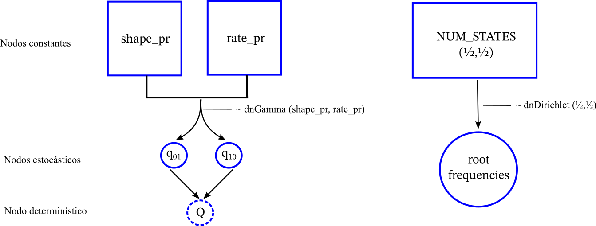
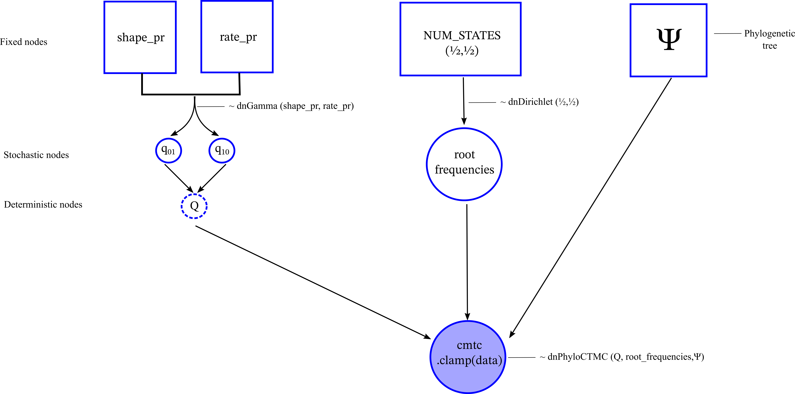

Creado por Rosana Zenil-Ferguson (Enero 2025)

Para este tutorial vamos a ajustar un modelo para un caracter discreto. El caracter discreto es polinización y los estados son Insecto(0) o Viento (1).

## Datos

103 taxones en una filogenia ultramétrica

 + Lista de especies con su polinización - [Datos](files/poliniza_datos.csv)
 
 + Árbol filogenético- [Filogenia](files/poliniza_arbol.tre)
 
 
## El modelo
 
El modelo en un gráfico de círculos y flecha se ve así


Vamos a implementar este modelo que es una CMTC como lo describimos en la sección anterior utilizando estadística Bayesiana en RevBayes. Recuerda que en Bayesiana asumimos que los parámetros $$q_{01}$$ y $$q_{10}$$ son desconocidos pero son variables aleatorias, lo que nos interesa es observar su distribución posterior para poder argumentar que tan rápido o lento ha sido la evolución de la polinización y como cambio a través del árbol filogenético.
 

## Código de RevBayes
 
 1. Empecemos con el número de estados y dos vectores ``moves`` guarda toda las propuestas para mover los parámetros. El vector ``monitors`` guarda las inferencia resultante del MCMC, principalmente la distribución posterior de todos los parámetros.
    
    + Baja el archivo del árbol filogenético [aquí](https://github.com/ixchelgzlzr/filo_bayes_UNAM/blob/main/docs/discrete/files/poliniza_arbol.tre)
    + Baja el achivo con los datos [aquí](https://github.com/ixchelgzlzr/filo_bayes_UNAM/blob/main/docs/discrete/files/poliniza_datos.csv)
 
    ```
    # Numero de estados
    NUM_STATES=2
    
    # Propuestas (moves), monitores (lo que resulta del MCMC)
    moves = VectorMoves()
    monitors = VectorMonitors()
    ```

2. Lectura de los datos y la filogenia

    ```
    ### Filogenia
    observed_phylogeny <- readTrees("data/poliniza_arbol.tre")[1]


    ## Datos
    ## 0 = Insecto
    ## 1 = Viento
    data <- readCharacterDataDelimited("data/poliniza_datos.csv",
    stateLabels=2,
    type="NaturalNumbers",
    delimiter=",",
    header=TRUE)
    
    taxa <- observed_phylogeny.taxa()
    ```

3. Distribuciones *a priori* de los parámetros

   Utilizaremos la distribución Gama como *a priori* para los parámetros de transición. 
   
   ```
   shape_pr := 0.5
   rate_pr = observed_phylogeny.treeLength()/50
   
   q_01 ~ dnGamma(shape=shape_pr, rate=rate_pr) ### Insecto a Viento
   q_10 ~ dnGamma(shape=shape_pr, rate=rate_pr) ### Viento a Insecto
   
   # En el vector moves vamos guardando las propuestas
   moves.append(mvScale( q_01, weight=2 ))
   moves.append(mvScale( q_10, weight=2 ))
   ```
   Lo que acabamos de hacer se representa en el modelo gráfico de RevBayes como lo siguiente
    
   

4. Construye correctamente el modelo matemático a través de la Q-matriz

   ```
   ### Modelo Mk2 empieza con una matriz llena de zeros
   for (i in 1:2){
   for (j in 1:2){
          q[i][j]:= 0.0
      }
   }
   ####
   q[1][2] := q_01
   q[2][1] := q_10
   
   # Definir la Q-matriz infinitesimal (la derivada de la probabilidad)
   
   rate_matrix := fnFreeK(q, rescaled=false, matrixExponentialMethod="scalingAndSquaring")
   ```
   
   
   
5. Estimación del valor de la raíz

    No conocemos si la raíz es 0 o 1 (insecto o viento) así que necesitamos estimarla. Como estamos en un contexto Bayesiano necesitaremo asumir que las frecuencias de un estado u otro son aleatorias y les asignaremos una distribución *a priori* Dirichlet, que es una distribución multivariada de probabilidad (dos estados con dos frequencias necesitan una distribución que considere los dos valores simultáneamente).
    
   ```
   root_frequencies ~ dnDirichlet(rep(1,NUM_STATES))
   
   # Agregamos dos propuestas para la el valor de la raiz
   
    moves.append(mvBetaSimplex(root_frequencies, alpha=0.5, weight=2))
    
    moves.append(mvElementSwapSimplex(root_frequencies, weight=3))
   ```
   
   
6. Paso final para definir el modelo Mk2
    
   Como lo muestra la imagen anterior por el momento tenemos un gráfico desconectados. Para conectarlos tenemos que unirlos bajo una distribución de probabilidad que se defina en el árbol filogenético. Esta distribución de probabilidad es la que va a calcular internamente la función de verosimilitud incorporando la información de la filogenia.
   
   ```
   # El modelo Mk2 en la filogenia se llama PhyloCTMC (phylogenetic continuous time markov chain)
    
   ctmc ~ dnPhyloCTMC(Q= rate_matrix, tree=observed_phylogeny, nSites=1, rootFreq=root_frequencies, type="NaturalNumbers")
   ```
   
   
7. Cálculo de la función de verosimilitud

    Hasta este punto no hemos tomado en cuenta para nada los datos en las puntas del árbol. Pero por supuesto, necesitamos los datos para calcular la verosimilitud. En RevBayes, hacemos esto a través de una función que se llama ``clamp()`` , o en español pinzar. Esto quiere decir que a la distribución de probabilidad ``dnPhyloctmc()`` le vamos a pinzar en un valor observado que son nuestros estados del caracter para cada uno de los taxones observados. 

   ```
    # Pinzamos nuestros datos a la distribucion de probabilidad dnPhyloCTMC
    ctmc.clamp(data)
    ```
    
    
    Una vez que hemos pinzado los datos, lo que generamos es la **distribución posterior del modelo Mk2** y podemos realizar inferencia Bayesiana sobre este objeto
    
## Inferencia Bayesiana sobre el modelo

Ya sabemos como calcular la distribución posterior pero ahora necesitamos enfocarnos en el MCMC para obtener muestras de la distribución posterior de nuestros parámetros. 

Si observamos bien, durante la codificación del modelo también especificamos los ``moves`` o propuestas de cómo cambia cada parámetro. 

1. Descripción de las propuestas para los movimientos del MCMC
    + ``mvScale( q_01, weight=2 )`` esta propuesta rescala el valor original de $$q_{01}$$ dos veces durante una iteración
    + ``mvBetaSimplex(root_frequencies, alpha=0.5, weight=2)`` esta propuesta propone dos valores entre 0 y 1 que suman 1 que representan la frequencia en la que encotraríamos 0 o 1 como valor de la raìz respectivamente. Propone dos veces durante una iteración del MCMC
    + ``mvElementSwapSimplex(root_frequencies, weight=3)`` esta propuesta intercambia lo que teniamos como frequencias para la raíz. Por ejemplo, si empezamos con frecuencias (0.4, 0.6), elementswap intercambia a (0.6,0.4) representando las frecuencias de los estados 0 y 1 respectivamente.
    
    Así como lo describimos en la clase del MCMC, en cada una de estas propuestas se evaluan los momios, y si estos mejoran y si son mayores que un valor aleatorio entre 0 y 1 se aceptan las propuestas de valores de los parámetros $$q_{01}, q_{10}, root_frequencies$$
    
2. Guarda el modelo en una cajita para poderlo utilizar

    Este es un paso simple pero importante en RevBayes. En este paso jalamos todo el modelo gráfico y lo ponemos en una "cajita" para utilizarlo en el MCMC
    
    ```
    # Mymodel es como una caja que guarda todo el objeto que es el modelo.
    mymodel = model(rate_matrix)
    ```

3. Creando la inferencia- Los monitores

    Los monitores ``monitors`` guardan toda nuestra inferencia, y son la parte importante que necesitamos para analizar los resultados

    ```
    # Los monitores, como su nombre lo dice van dando seguimiento a lo que esta pasando durante el MCMC

    # Este monitor va guardando la posterior (el mas importante)
    monitors.append(mnModel(filename="output/mk2_polinizador.log", printgen=1))

    ##Este monitor imprime en pantalla
    monitors.append(mnScreen(printgen=10,q_01))

    ## Este monitor va guardando lo que ocurre en los nodos- la reconstruccion ancestral
    monitors.append(mnJointConditionalAncestralState(filename="output/asr_mk2_polinizador.log",printgen=100,tree=observed_phylogeny,ctmc=ctmc,type="NaturalNumbers"))

    ## Este monitor va fuardando lo que ocurre en las ramas- el mapa estocastico

    monitors.append( mnStochasticCharacterMap(ctmc=ctmc,printgen=100,filename="output/stochmap_mk2_polinizador.log", include_simmap=true))

    ```

    + ``mnModel`` guarda las muestras de la distribución posterior de todos los parametros en el archivo especificado
    + ``mnScreen`` imprime en pantalla para que podamos seguir que es lo que esta pasado
    + ``mnJointConditionalAncestralState`` guarda lo que sucede en los nodos de la filogenia y nos ayuda a hacer la reconstrucción ancestral utilizando la probabilidad posterior marginal (esto es diferente de las reconstrucciones ancestrales en otros softwares)
    + ``mnStochasticCharacterMap`` guarda lo que sucede en las ramas de la filogénia a traves de mapas estocásticos que se pueden resumir en los pasos siguientes.


4. Corriendo el MCMC

    Recuerda siempre correr dos cadenas para comparar la convergencia
    ```
    #### Corramos el MCMC dos veces
    
    mymcmc = mcmc(mymodel, monitors, moves, nruns=2, moveschedule="random")
    mymcmc.run(50000)
    ```

5. Creando resúmenes para mapas estocásticos y reconstrucciones ancestrales

    ```
    # Con los resultatos ya guardados generemos la reconstruccion ancestral en los nodos
    anc_state_trace = readAncestralStateTrace("output/asr_mk2_polinizador_run_1.log")
    ancestralStateTree(observed_phylogeny, anc_state_trace, "output/asr_mk2_polinizador.tree",summary_statistic="mean", reconstruction="marginal")
    
    # Y un resumen de los mapas estocasticos.
    anc_state_trace = readAncestralStateTrace("output/stochmap_mk2_polinizador_run_1.log")
    characterMapTree(observed_phylogeny, anc_state_trace, character_file="output/stochmap_mk2_polinizador.tree", posterior_file="output/posteriorpole.tree", burnin=1000, reconstruction="marginal")
    
    ```

### Código Revbayes

El código completo lo puedes encontrar [aquí](files/Mk2.Rev) 
