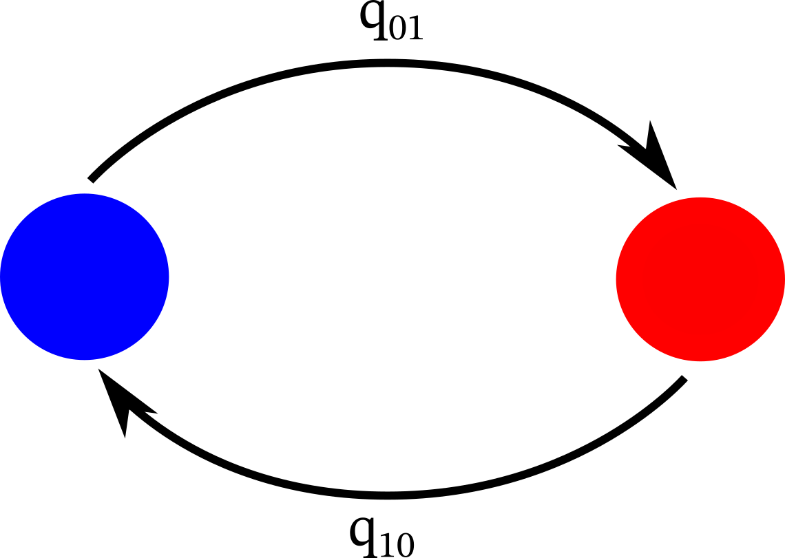
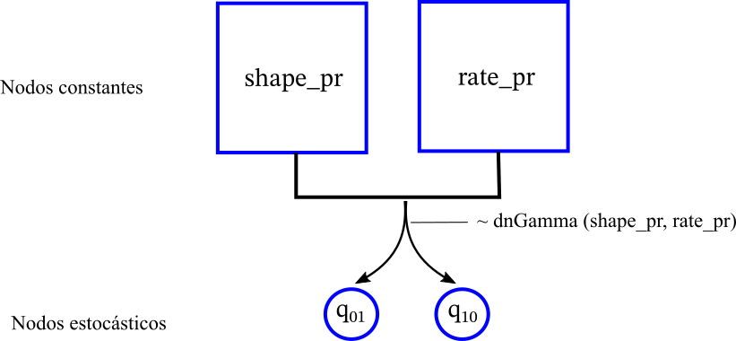
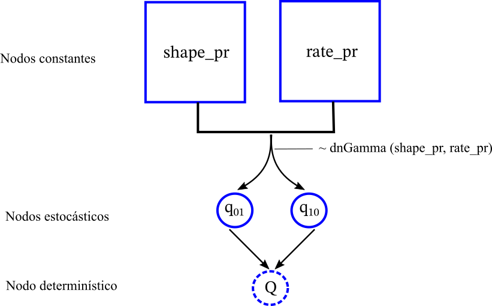
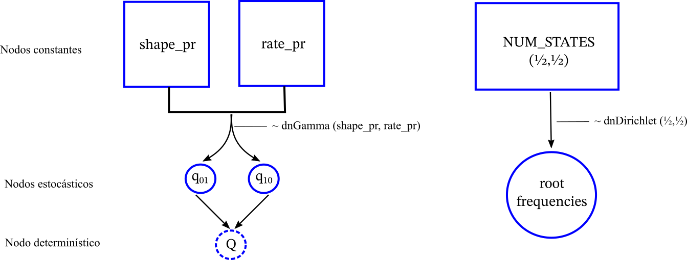
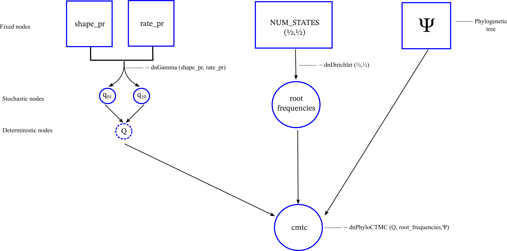
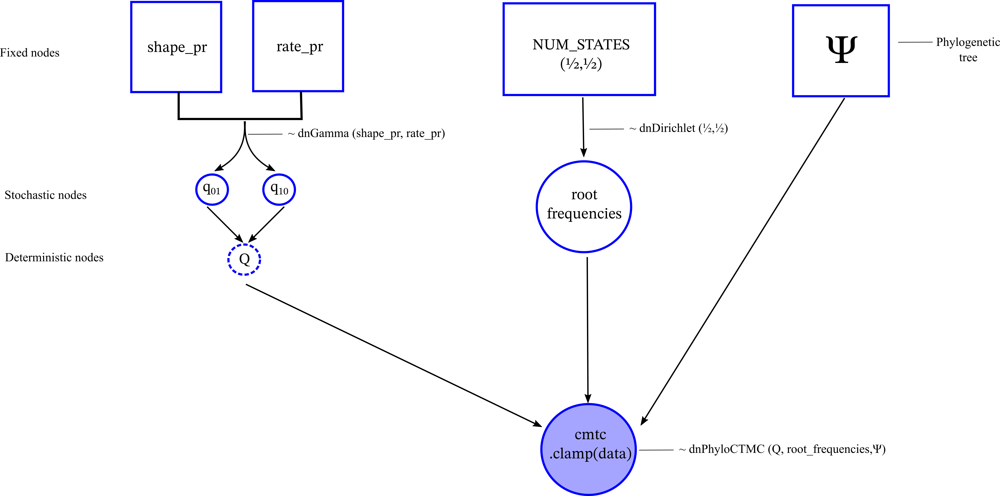

Created by Rosana Zenil-Ferguson for MOLE Workshop at Woods Hole, MA(May 2025). 
Data from di Stilio and Zenil-Ferguson. All traits considered. 2025. *Submitted*. 

For this tutorial we will create a discrete character model for a pollinization with two states: Insect pollination (I) is denoted by 0 and wind pollination (W) is 1.

## Input

103 taxa in a bifurcating and ultrametric tree

 + List with species and their pollinization [here](files/poliniza_datos.csv)
 
 + Phylogenetic tree- [here](files/poliniza_arbol.tre)
 
## Model
 
The traditional visualization of a continuous time markov chain (CTMC) for a discrete character looks like this. When it has two states, we call this model Mk2.


We will implement this Mk2 model in Revbayes and leverage the Bayesian framework. Remember that we assume $$q_{01}$$ and $$q_{10}$$ are rate parameters (change over time) and for this reason is useful to apply this model in ultrametric trees. In Bayesian statistics,  the parameters that are unknown to us but we assume they are random variables. This means that we are interested in inferring their probability density function (p.d.f) better known as the **posterior distribution**. By having a p.d.f we can characterize their tempo, meaning we can understand uncertainty in the rates of evolution

 ## RevBayes code
 
 1. Let's start with the vector ``moves`` that saves all the proposal moves for each of the parameters. Also the vector ``monitors`` saves the inference. Especially the posterior distribution for each of the parameters, so we can't forget that.
 
``` 
# Number of states
NUM_STATES=2

# Proposals (moves), Monitors(follow the inference from the MCMC)
moves = VectorMoves()
monitors = VectorMonitors()
```

2. Reading our data and the phylogeny

``` 
### Phylogenetic tree
observed_phylogeny <- readTrees("data/poliniza_arbol.tre")[1]

## Data
## 0 = Insect pollinated
## 1 = Wind pollinated
data <- readCharacterDataDelimited("poliniza_datos.csv",
stateLabels=2,
type="NaturalNumbers",
delimiter=",",
header=TRUE)

taxa <- observed_phylogeny.taxa()
```

3.  Prior distributions of the parameters

We will use the Gamma distribution as  **prior distribution** for the rates of transition. 

```
#### Prior distribution for transition rates

shape_pr := 0.5
rate_pr = observed_phylogeny.treeLength()/5

q_01 ~ dnGamma(shape=shape_pr, rate=rate_pr) ### Insect to Wind
q_10 ~ dnGamma(shape=shape_pr, rate=rate_pr) ### Wind to insect

# We start storing the proposals for each parameter. These represent how we are going to explore the parameter space 
moves.append(mvScale( q_01, weight=2 ))
moves.append(mvScale( q_10, weight=2 ))
```

What we have done is represented in the graphical model for revBayes like this. 



4. Build the CTMC called in comparative methods the Mk2 (Markov model with 2 states) using its essential tool: the Q-matrix

```
### Building the Q-matrix for the Mk2.
#First start with a matrix full of zeros
for (i in 1:2){
for (j in 1:2){
        q[i][j]:= 0.0
    }
}
#### Then start filling the matrix
q[1][2] := q_01
q[2][1] := q_10

# The Q-matrix is an infinitesimal matrix, meaning it is a derivative of the probability matrix. 

rate_matrix := fnFreeK(q, rescaled=false, matrixExponentialMethod="scalingAndSquaring")
```



5. Root estimation

We do not know if the most common recent ancestor of all taxa were wind or insect pollinated, so we need to estimate the value of the root. In the Bayesian statistics framework the frequencies at the root are two extra parametes that we need to estimate. Therefore, we will assume initial equal frequencies for each state. Since there are two states we will need a bivariate prior distribution as the prior for a vector with two frequencies that add up to 1. A very useful distribution for this goal is the Dirichlet, a multivariate proability distribution that allows us to assign equal frequency to both states. 

``` 
root_frequencies ~ dnDirichlet(rep(1,NUM_STATES))

# Two proposals to explore those values at the root multiple times. 

moves.append(mvBetaSimplex(root_frequencies, alpha=0.5, weight=2))

moves.append(mvElementSwapSimplex(root_frequencies, weight=3))
```



6. Last step to build the Mk2

As shown in the previous image we have a graphical model with disconnected nodes. In order to connect them we have to merge them under a probability distribution for phylogenetic trees. This probability distribution is the one that internally calculates the likelihood function throughout the tree and considers the prior distribution for the parameters throughout the structure of the tree. 

```
# The Mk2 model has an stochastic phylogenetic distribution called PhyloCTMC (phylogenetic continuous time markov chain)

ctmc ~ dnPhyloCTMC(Q= rate_matrix, tree=observed_phylogeny, nSites=1, rootFreq=root_frequencies, type="NaturalNumbers")
```



7. Calculating the likelihood function

Up to this point we have ignored the data. Of course, we need the data to calculate the likelihood. In RevBayes we do this throughout a function called ``clamp()``. This makes our  ``dnPhyloCTMC()`` consider the values on the tips of the tree

``` 
#Fix our observations to our stochastic model
ctmc.clamp(data)
```


Once the data are clamped we will have a  **posterior distribution for the Mk2 model** and we can perform our inference

## Storing our Bayesian inference 

We have calculated the posterior distribution but now we need to focus on how to obtain the inference. If we look closely, throughout the code we specified  ``moves`` that are the proposals of the MCMC for each of the parameters. 

1. A brief description of the proposals

+ ``mvScale( q_01, weight=2 )`` this proposal rescales the original value of $$q_{01}$$ twice per iteration.
+ ``mvBetaSimplex(root_frequencies, alpha=0.5, weight=2)``  this function proposes two values in the interval (0,1) that added result in 1. They represent the frequency at which we would find the state 0 or the state 1 at the root of the tree.
+ ``mvElementSwapSimplex(root_frequencies, weight=3)`` this function proposes to swap the frequencies. For example, if we had (0.4, 0.6), elementswap exchanges the position of those values (0.6,0.4).

Just as discussed in the lectures, each of this proposals are going to contribute to the posterior odds, and if those improve they may get accepted.

2. The "store in a box" step of RevBayes

This is an important step for RevBayes software. We want to "store" the whole graphical object to be able to manipulate it. The function `model()` allows us to do this. 

``` 
# mymodel is a "box" that stores the whole graphical model properties

mymodel = model(rate_matrix)
```

3. The monitors follow the inferential process

The ``monitors`` store all our inference, without them you won't be able to retrieve your posterior distributions. There are many types of monitors as you will see below. 

``` 
## This monitor saves the whole posterior distribution for each of the parameters
monitors.append(mnModel(filename="output/mk2_polinizador.log", printgen=1))

## This monitor prints in screen one parameter so you know that is running and how far.
monitors.append(mnScreen(printgen=10,q_01))

## This monitor tracks what is going on with the ancestral state reconstruction at each node
monitors.append(mnJointConditionalAncestralState(filename="output/asr_mk2_polinizador.log",printgen=100,tree=observed_phylogeny,ctmc=ctmc,type="NaturalNumbers"))

## This monitor creates stochastic character maps (evolution over the branches)- this is very slow for very complicated models

# monitors.append( mnStochasticCharacterMap(ctmc=ctmc,printgen=100,filename="output/stochmap_mk2_polinizador.log", include_simmap=true))
```

+ ``mnModel`` Saves the samples of the posterior distribution created by the MCMC algorithm
+ ``mnScreen`` Prints in screen so you know something is happening
+ ``mnJointConditionalAncestralState`` Saves the ancestral state reconstruction utilizing the marginal posterior probability (be careful this is very different to what phytools or other software does) utilizando la probabilidad posterior marginal
+ ``mnStochasticCharacterMap`` calculates stochastic character maps that are transitions that occur along the branches. This is very important yet very difficult to calculate. 


4. Run your MCMC

**Remember to always run two chains to show that the MCMC has converge**
``` 
#### We always run TWO times our MCMC at the very least to check for convergence

mymcmc = mcmc(mymodel, monitors, moves, nruns=2, moveschedule="random")
mymcmc.run(50000)
```

5. Create summaries of your ancestral state reconstruction and stochastic maps

```
# Once we have the ancestral state reconstruction runs we read them
anc_state_trace = readAncestralStateTrace("output/asr_mk2_polinizador_run_1.log")

# Then summarize them using the MARGINAL of JOINT
ancestralStateTree(observed_phylogeny, anc_state_trace, "output/asr_mk2_polinizador.tree",summary_statistic="mean", reconstruction="marginal")

# Summarize stochastic maps (but we will do it again in R through revgadets so not as critical)

#anc_state_trace = readAncestralStateTrace("output/stochmap_mk2_polinizador_run_1.log")
#characterMapTree(observed_phylogeny, anc_state_trace, character_file="output/stochmap_mk2_polinizador.tree", posterior_file="output/posteriorpole.tree", burnin=1000, reconstruction="marginal")
q()
```
